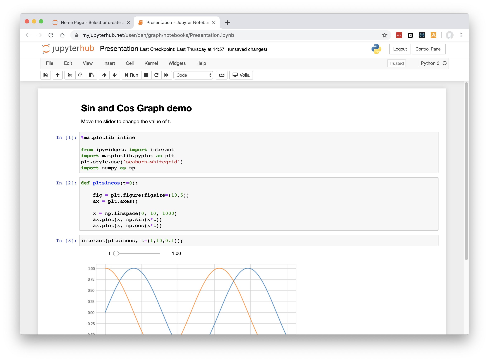
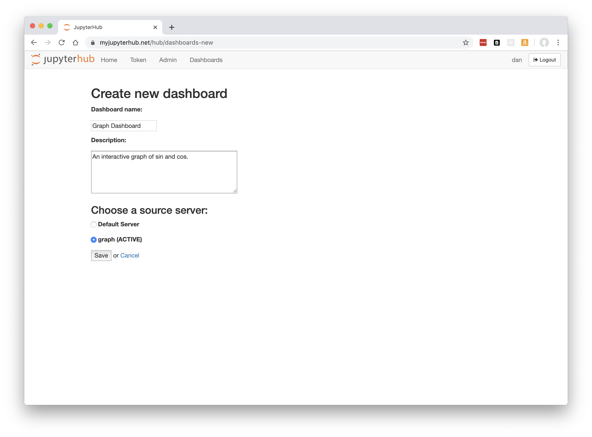
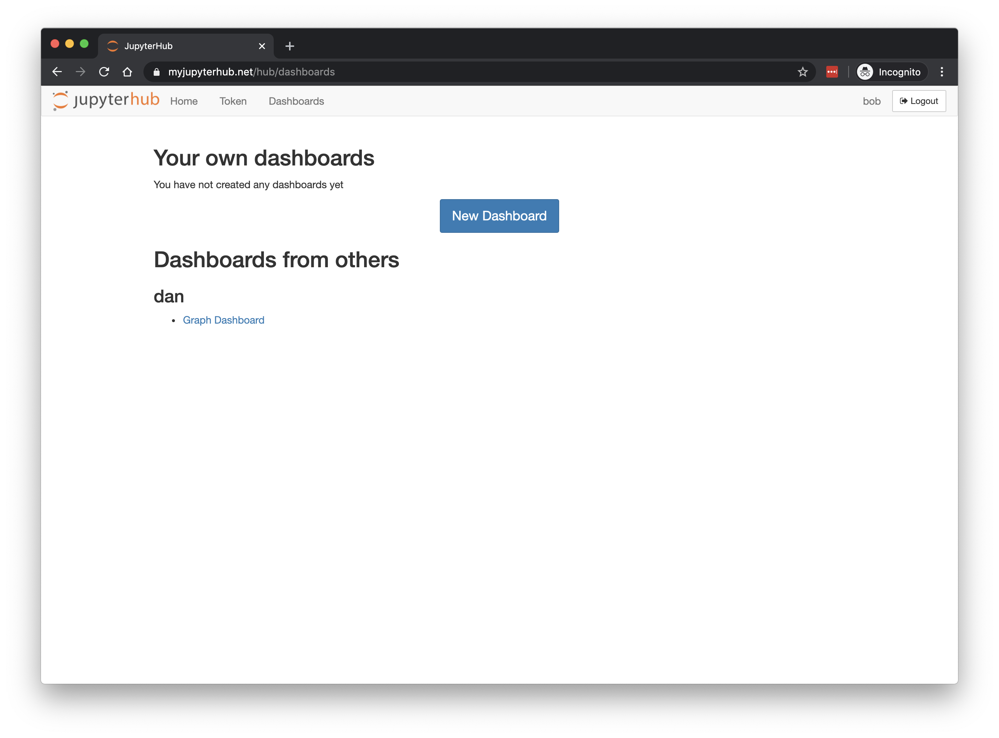
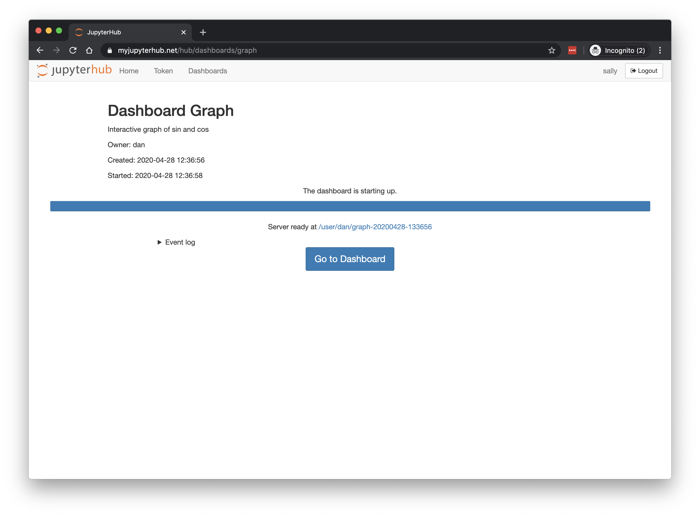
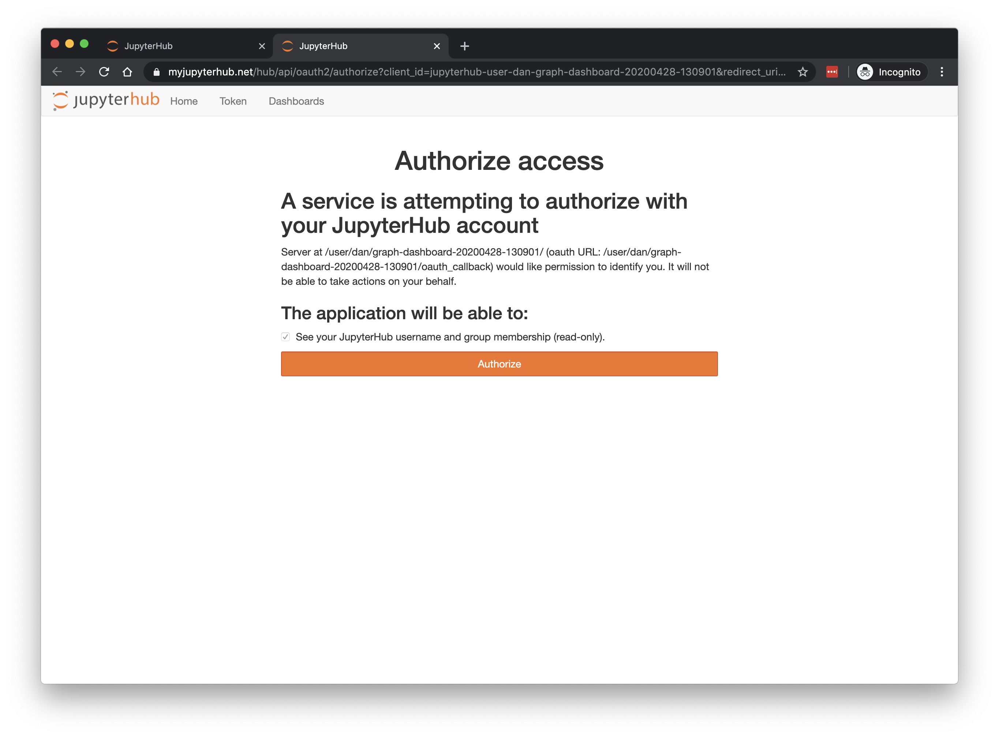
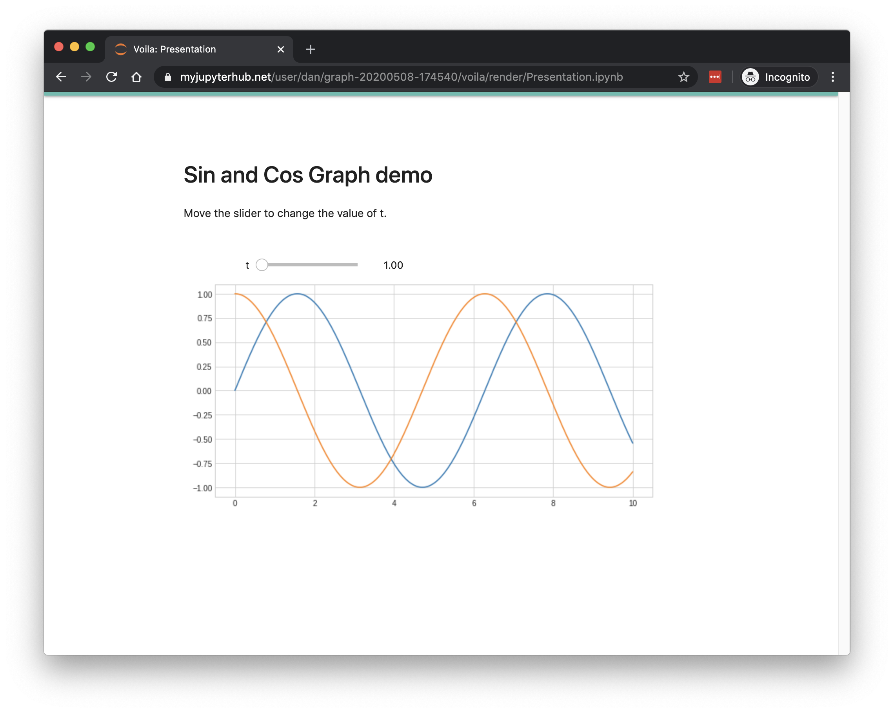

# ContainDS Dashboards for JupyterHub

A Dashboard publishing solution for Data Science teams to share results with decision makers.

Run a private on-premise or cloud-based JupyterHub with extensions to instantly publish notebooks as user-friendly interactive 
dashboards to share with non-technical colleagues.

This open source package allows users to create interactive Jupyter notebooks that can be instantly and reliably published as 
secure interactive [Voila](https://voila.readthedocs.io/en/stable/) web apps. Any authorised JupyterHub user can view the dashboard.

## How it works

- Data scientist creates a Jupyter Notebook as normal
- Data scientist creates a new Dashboard to clone their Jupyter server
- Other logged-in JupyterHub users see the dashboard in their list
- Click to launch as a server, using OAuth to gain access
- User sees a safe user-friendly Voila version of the original notebook

All of this works through a new Dashboards menu item added to JupyterHub's header.

_Data scientist creates a Jupyter Notebook as normal_



_Data scientist creates a new Dashboard to clone their Jupyter server_




_Other logged-in JupyterHub users see the dashboard in their list_



_Click to launch as a server_



_Uses OAuth to gain access_



_Other user sees a safe user-friendly Voila version of the original notebook_




## Requirements

Basic requirements:

- JupyterHub 1.0+
- DockerSpawner 0.11.0+
- Python 3.6+

You should be able to use any authenticator for users to login - for example, corporate Google email sign in, or LDAP.

Support for Kubernetes JupyterHub installations running KubeSpawner is in development - please get in touch with your requirements to help move this forward.

## Installation

Make sure your [JupyterHub is already working](https://jupyterhub.readthedocs.io/en/stable/installation-guide.html), using [DockerSpawner](https://github.com/jupyterhub/dockerspawner) to start the single-user servers.

To install the components of the ContainDS Dashboards extension:

```
pip install cdsdashboards
```

### Generic Changes to jupyterhub_config.py

Ensure you enable [named servers](https://jupyterhub.readthedocs.io/en/stable/reference/config-user-env.html#named-servers), and also check that DockerSpawner has a naming convention compatible with named servers:

```
c.JupyterHub.allow_named_servers = True

c.DockerSpawner.name_template = "{prefix}-{username}-{servername}"

c.DockerSpawner.image = 'ideonate/jh-voila-oauth-singleuser:scipy-dc9744740e12'
```

The image used for the single-user servers must have [Voila](https://github.com/voila-dashboards/voila) and [jhsingle-native-proxy](https://github.com/ideonate/jhsingle-native-proxy) installed - see details below, or try the image listed above.

### Enabling Dashboards in jupyterhub_config.py

The following options in your config file will install the extension. Please note if you have existing customisations you may need to merge these with your existing settings.

```
from cdsdashboards.app import CDS_TEMPLATE_PATH, cds_tornado_settings
from cdsdashboards.hubextension import cds_extra_handlers

c.JupyterHub.template_paths = [ CDS_TEMPLATE_PATH ]
c.JupyterHub.tornado_settings = cds_tornado_settings
c.JupyterHub.extra_handlers = cds_extra_handlers
```


## Options

Options to remove 'Named Server' functionality for users on their home page. You can remove the named server section and/or the new bottom section where servers started to act as dashboards are hidden.

```
c.JupyterHub.template_vars = {
    'cds_hide_user_named_servers': False,
    'cds_hide_user_dashboard_servers': False
    }
```

## Image

The image you use for the single-user server should have [Voila](https://github.com/voila-dashboards/voila) and [jhsingle-native-proxy](https://github.com/ideonate/jhsingle-native-proxy) installed, plus a second 'entrypoint' at `/opt/conda/bin/voila-entrypoint.sh` to run the Voila server.

Please see [docker-singleuser-images](./docker-singleuser-images) for an example, or use the ones created for you already, e.g. [jh-voila-oauth-singleuser:scipy-dc9744740e12](https://hub.docker.com/r/ideonate/jh-voila-oauth-singleuser).

## Contact and Support

This software is an alpha version. Please see LICENSE for details.

Please do get in touch if you try out the package, or would like to but need some support. I would be very interested to find out how it can be used, and to work (without charge) to help you get it running. The project needs feedback in order to develop further!

For more background on this project and our related ContainDS Desktop product, please see our website: [containds.com](https://containds.com/).

Contact [support@containds.com](mailto:support@containds.com) with any comments or questions at all. Thank you.
